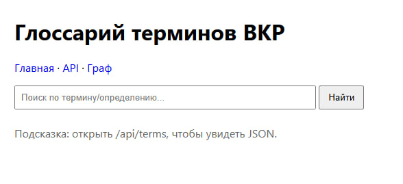

# Глоссарий терминов ВКР  
## RPC / gRPC / Protocol Buffers / Docker

Проект представляет собой микросервисное приложение — глоссарий терминов,
используемых в выпускной квалификационной работе на тему:

**«Сравнительный анализ технологии Web Components и современных
фронтенд-фреймворков для разработки пользовательских интерфейсов»**

Практическая работа выполнена в рамках изучения технологий  
**RPC, gRPC и Protocol Buffers**.

> Ссылка на GitHub-репозиторий: https://github.com/Ran3boy/RPC **

---

## 1. Цель практической работы

Целью практической работы является:

- изучение принципов удалённого вызова процедур (RPC);
- реализация взаимодействия сервисов с использованием **gRPC**;
- описание контрактов API с помощью **Protocol Buffers**;
- контейнеризация микросервисов с использованием **Docker** и **Docker Compose**;
- демонстрация процесса развёртывания и проверки работы сервиса
  с оформлением отчёта в формате Markdown.

---

## 2. Используемые технологии

В ходе выполнения работы были использованы следующие технологии:

- **gRPC** — фреймворк для удалённого вызова процедур поверх HTTP/2;
- **Protocol Buffers** — бинарный формат сериализации данных и описание API;
- **Python** — язык реализации сервисов;
- **Docker** — контейнеризация приложений;
- **Docker Compose** — оркестрация микросервисов;
- **FastAPI** — web-шлюз для доступа к сервису через браузер.

---

## 3. Архитектура приложения

Приложение реализовано в виде микросервисной архитектуры
и состоит из двух основных сервисов.

### 3.1 gRPC-сервис глоссария (backend)

- реализует бизнес-логику хранения и получения терминов;
- использует Protocol Buffers для описания сообщений;
- взаимодействует с клиентами по протоколу gRPC;
- работает на порту `50051`.

### 3.2 Web-шлюз (frontend gateway)

- предоставляет web-интерфейс и HTTP API;
- взаимодействует с backend-сервисом исключительно через gRPC;
- предназначен для демонстрации работы сервиса;
- работает на порту `8000`.

---

## 4. Структура проекта

```text
vkr-glossary-grpc/
 ├─ glossary_service/      # gRPC backend-сервис
 ├─ web_gateway/           # Web UI и HTTP API
 ├─ protobufs/             # .proto файлы (контракты)
 ├─ screenshots/           # Скриншоты работы сервиса
 ├─ docker-compose.yml     # Конфигурация Docker Compose
 └─ README.md              # Отчёт по практической работе
```

---

В данном разделе приведён пошаговый процесс развёртывания проекта
и проверки его работоспособности.

### 5.1 Предварительные требования

Для запуска проекта необходимо:

- установленный и запущенный **Docker Desktop**;
- (рекомендуется) установленный **Git** для публикации проекта в GitHub.

Проверка корректности установки Docker выполняется следующими командами:

```bash
docker --version
docker compose version
```

### 5.2 Сборка и запуск проекта

В корневой директории проекта необходимо выполнить команду:

```bash
docker compose up --build
```

В процессе выполнения команды:

- происходит сборка Docker-образов сервисов;
- запускаются два контейнера: gRPC backend и web-шлюз.

Для остановки работы сервисов используется сочетание клавиш **Ctrl + C**,
после чего рекомендуется выполнить команду:

```bash
docker compose down
```

### 5.3 Проверка запуска контейнеров

После запуска проекта необходимо убедиться,
что контейнеры успешно запущены.

Для этого выполняется команда:

```bash
docker ps
```

#### Ожидаемый результат

В списке запущенных контейнеров должны присутствовать два сервиса:
- контейнер web-шлюза (порт **8000**);
- контейнер gRPC-сервиса глоссария (порт **50051**).

Названия контейнеров могут незначительно отличаться
в зависимости от конфигурации Docker Compose.

---

### 5.4 Проверка работы web-интерфейса

После успешного запуска контейнеров необходимо открыть
в браузере следующий адрес:

**http://localhost:8000**

Если отображается веб-страница глоссария, это означает, что:
- web-шлюз функционирует корректно;
- взаимодействие между web-сервисом и backend-сервисом
осуществляется через протокол gRPC.

#### Скриншот работающего сервиса

Web-интерфейс доступен по адресу:  
**http://localhost:8000**



---

### 5.5 Проверка работы HTTP API (дополнительно)

Для дополнительной проверки работоспособности системы
можно обратиться к HTTP API web-шлюза.

Для этого необходимо открыть в браузере:

**http://localhost:8000/api/terms**

Ожидается получение JSON-ответа, что подтверждает
корректную работу web-сервиса и его взаимодействие
с gRPC backend-сервисом.

---

## 6. Результаты выполнения практической работы

В ходе выполнения практической работы были получены следующие результаты:

- реализовано микросервисное приложение на основе RPC-подхода;
- организовано взаимодействие сервисов с использованием gRPC;
- применён Protocol Buffers для описания контрактов API;
- выполнена контейнеризация сервисов с помощью Docker.
